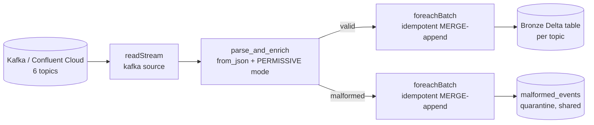

# Hyperlocal Food-Delivery Event Simulator

A realistic, **event-driven** (not row-by-row random) source-system simulator
for a food-delivery / restaurant-discovery marketplace. It models Customers,
Restaurants, Delivery Partners (DPs) and the Platform as interacting state
machines and publishes their real-time event streams to Kafka, so you can
build a genuine Bronze → Silver → Gold streaming pipeline (Spark Structured
Streaming, Flink, whatever you like) against realistic data.

This repo now also includes a production-style **Bronze ingestion layer**
(Databricks + PySpark Structured Streaming + Delta Lake) — see the
"Bronze Layer" section near the end of this file. Silver/Gold are not
included yet.

## What it produces

| Kafka topic | Partition key | Rough volume |
|---|---|---|
| `order-lifecycle-events` | `order_id` | medium, bursty on peaks |
| `dp-status-events` | `dp_id` | medium |
| `gps-pings` | `dp_id` | **highest volume** — every few sim-seconds per active DP |
| `restaurant-status-events` | `restaurant_id` | low-medium, heartbeat-driven |
| `payment-events` | `order_id` | medium, spikes during simulated gateway outages |
| `dispatch-decision-events` | `order_id` | low, one(+) per order |

Every event is JSON with `event_id`, `event_time` (simulated, ISO-8601 UTC),
and `schema_version`. See `simulator/schemas.py` for the exact field list per
topic — it's the single source of truth, easier to read than a table here.

## Why it's realistic, not just random rows

- **State machines, not coin flips per row.** Orders, DPs and restaurants
  each have an explicit state machine (`simulator/state_machines.py`) with
  legal transitions only. An order can't go `PLACED -> DELIVERED` directly.
- **Consistent IDs and causality.** A `gps-pings` event's `order_id` always
  matches a real, currently-in-flight `order-lifecycle-events` order. A
  `payment-events` retry references the `payment_id` it's retrying via
  `retry_of_payment_id`.
- **Time-of-day demand curve.** Lunch (12:00–14:30) and dinner (19:00–22:30)
  windows multiply order arrival rate 2.8–3.2x over baseline (configurable).
- **Supply that doesn't just match demand.** DP online-ratio follows its own
  curve, capped below 100%, with random zone-level "shortage" windows — so
  supply/demand liquidity genuinely gets tight sometimes, which is the point
  of the Zone Supply-Demand Ratio metric.
- **Correlated failures, not independent ones.** Payment failures spike
  together during a simulated gateway-outage window (`chaos.py`'s
  `GatewayOutageTracker`) — a realistic "retry storm" instead of every
  payment failing on an unrelated dice roll.
- **Real GPS trajectories.** Pings are linearly interpolated between
  restaurant and customer coordinates with small road-like jitter, realistic
  speed ranges, occasional traffic slowdowns, occasional dropped pings, and
  occasional injected anomalies (`teleport`, `stationary_drift`) — the
  ground-truth label lives in `debug_anomaly_type` so you can validate your
  downstream anomaly detector against it (a real GPS SDK would never send
  this field; it's a simulator-only convenience).
- **Batching is a real multi-order trip**, not a synthetic flag: a second
  order gets attached to a DP that's still `WAITING_AT_RESTAURANT` at the
  *same* restaurant, and the DP genuinely does two sequential drop-offs.
- **Chaos at the publish boundary**: duplicate events, late/out-of-order
  emission, are applied uniformly to every topic in `kafka_producer.py`, so
  your consumer has to handle it the way a real Kafka pipeline would.

## Project structure

```
food_delivery_simulator/
├── main.py                        # CLI entrypoint (auto-loads .env if present)
├── config/config.yaml             # every tunable parameter; ${VAR:-default} for secrets
├── .env.example                   # copy to .env for Confluent Cloud credentials
├── docker-compose.yml             # optional local single-broker Kafka + UI
├── requirements.txt
├── scripts/
│   └── create_topics.py           # pre-creates the 6 topics (local broker or Confluent Cloud)
└── simulator/
    ├── config.py                  # typed config loader
    ├── entities.py                # zones/customers/restaurants/DPs generation
    ├── schemas.py                 # event dataclasses (source of truth for shape)
    ├── state_machines.py          # legal state transitions for Order/DP/Restaurant
    ├── geo.py                     # haversine, route interpolation, zone cells
    ├── clock.py                   # simulated clock + peak-hour multiplier
    ├── runtime_state.py           # shared in-memory world state
    ├── kafka_producer.py          # publish (kafka/console/file) + chaos injection
    ├── chaos.py                   # GPS anomaly/dropout + payment-outage tracker
    ├── logging_config.py
    ├── engine.py                  # orchestrator: wires generators, runs arrival loop
    └── generators/
        ├── order_generator.py       # PLACED..READY, and transition() for the rest
        ├── restaurant_generator.py  # online/offline + backlog heartbeat
        ├── dp_generator.py          # online/offline supply-pool sizing
        ├── payment_generator.py     # payment attempts, retries, gateway outages
        ├── dispatch_generator.py    # matching, batching, dispatch-decision-events
        └── gps_generator.py         # TripRunner: GPS + per-trip DP status
```

## How the 10 required metrics map to fields

| # | Metric | Primary fields |
|---|---|---|
| 1 | Driver Utilization Rate | `dp-status-events.status` transitions (IDLE ↔ ASSIGNED...DELIVERED) per `dp_id` |
| 2 | Zone Supply-Demand Ratio | idle-DP count from `dp-status-events` vs order count from `order-lifecycle-events`, both keyed by `zone_id` |
| 3 | Restaurant Kitchen Backlog | `restaurant-status-events.current_backlog` / `capacity_orders` |
| 4 | Restaurant Acceptance Rate & Latency | `order-lifecycle-events` `PLACED` → `ACCEPTED`/`REJECTED` timestamps |
| 5 | ETA Variance | `promised_eta_ts` (set at PLACED) vs actual `DELIVERED` `event_time` |
| 6 | Order Cancellation Rate | `state=CANCELLED`, `cancelled_by`, `cancellation_reason` |
| 7 | Restaurant-Side Wait Time | `dp-status-events` `WAITING_AT_RESTAURANT` → `PICKED_UP` gap, or `gps-pings` arrival vs `order-lifecycle-events.PICKED_UP` |
| 8 | Batching Efficiency / Detour Ratio | `dispatch-decision-events.is_batched` / `batch_id` / `planned_route_distance_km` vs actual `gps-pings` distance |
| 9 | Last-Mile Transit Anomaly Detection | `gps-pings.speed_kmph` / sequential lat-lon jumps (`debug_anomaly_type` is ground truth for testing only) |
| 10 | Payment Failure Rate / Retry Storms | `payment-events.status=FAILED`, `attempt_number`, `retry_of_payment_id`, `is_gateway_outage` |

## Running it

### 1. Dry run — no Kafka needed

```bash
pip install -r requirements.txt
python main.py --output-mode console --duration 5 --speed-factor 200 \
    --num-customers 100 --num-restaurants 15 --num-dps 40
```

Or write newline-delimited JSON per topic instead of printing:

```bash
python main.py --output-mode file --duration 60 --speed-factor 250
# -> ./output_events/order-lifecycle-events.jsonl, gps-pings.jsonl, ...
```

### 2. Real run against local Kafka

```bash
docker compose up -d          # single-broker Kafka (KRaft) + Kafka UI on :8080
pip install -r requirements.txt
python main.py --output-mode kafka --bootstrap-servers localhost:9092
```

Topics auto-create on first publish (`KAFKA_CFG_AUTO_CREATE_TOPICS_ENABLE=true`
in `docker-compose.yml`). For production-realistic partition counts, pre-create
them yourself instead of relying on auto-create defaults:

```bash
python scripts/create_topics.py --config config/config.yaml
```

### 3. Real run against Confluent Cloud

No code changes needed — the producer and the topic-bootstrap script both
read their connection details from environment variables (via `${VAR}`
expansion in `config/config.yaml`), so the same codebase points at a local
broker or Confluent Cloud purely based on what's set in your environment.

**Step 1 — get your cluster's connection details** from the Confluent Cloud
console: *your cluster → Cluster Settings → Endpoints* for the bootstrap
server, and *your cluster → API Keys → Create key* for an API key/secret
scoped to that cluster (or `confluent api-key create --resource <cluster-id>`
via the CLI).

**Step 2 — set credentials** (either export them, or copy `.env.example` to
`.env` and fill it in — `main.py` auto-loads `.env` if `python-dotenv` is
installed, which it is via `requirements.txt`):

```bash
cp .env.example .env
# edit .env:
#   KAFKA_BOOTSTRAP_SERVERS=pkc-xxxxx.ap-southeast-1.aws.confluent.cloud:9092
#   KAFKA_SECURITY_PROTOCOL=SASL_SSL
#   KAFKA_SASL_MECHANISM=PLAIN
#   KAFKA_API_KEY=...
#   KAFKA_API_SECRET=...
```

**Step 3 — pre-create the topics.** Confluent Cloud clusters typically ship
with topic auto-create **disabled**, unlike the local docker-compose broker,
so create them explicitly first (safe to re-run; skips topics that already
exist):

```bash
pip install -r requirements.txt
python scripts/create_topics.py --config config/config.yaml
```

**Step 4 — run the simulator** exactly as before; it picks up SASL_SSL and
your API key/secret automatically because `output.mode: kafka` and the
`kafka.*` fields in `config.yaml` now resolve from your environment:

```bash
python main.py --output-mode kafka
```

If credentials are missing or malformed you'll get an immediate, explicit
`RuntimeError` naming exactly which environment variable is unset, rather
than a slow/opaque connection timeout.

> **Never commit `.env`** or real API keys into `config/config.yaml` — the
> file only ever contains `${VAR:-default}` placeholders, so it's safe to
> keep in git as-is.

### 4. Point it at Structured Streaming / Flink

Once events are flowing into Kafka, consume with e.g.:

```python
df = (spark.readStream.format("kafka")
      .option("kafka.bootstrap.servers", "localhost:9092")
      .option("subscribe", "gps-pings")
      .load())
```

`event_time` in every payload is the field to use for event-time watermarking
— don't use Kafka's own ingestion timestamp, since the chaos layer
deliberately delays/reorders some events to make that distinction matter.

### Key CLI flags

| Flag | Overrides |
|---|---|
| `--output-mode {kafka,console,file}` | `output.mode` |
| `--bootstrap-servers` | `kafka.bootstrap_servers` |
| `--duration <minutes>` | `simulation.duration_minutes` (simulated minutes) |
| `--speed-factor <N>` | `simulation.speed_factor` (sim-minutes per real-second-ish; higher = faster/compressed) |
| `--seed <int>` | `simulation.random_seed` |
| `--num-customers / --num-restaurants / --num-dps` | `scale.*` |

Everything else (peak windows, failure rates, batching probability, GPS ping
interval, chaos probabilities, ...) is only in `config/config.yaml` — edit it
directly rather than growing the CLI surface further.

## Validated behavior (smoke-tested)

A 150-simulated-minute / small-scale run produced, among other things:
`PLACED → ACCEPTED → PREPARING → READY → ASSIGNED → PICKED_UP → DELIVERED`
funnels completing end-to-end, `REJECTED` and `CANCELLED` (by `CUSTOMER` and
`SYSTEM`) orders, payment `FAILED` + retries, batched dispatch decisions, and
injected `teleport` / `stationary_drift` GPS anomalies — all with zero
runtime errors across ~78k published events.

## Notes / things you'll likely want to tune first

- `scale.num_delivery_partners` relative to `demand.base_orders_per_min` is
  the single biggest lever on how "supply-starved" the simulation feels —
  the defaults are tuned to produce real (not constant) backlog and
  liquidity pressure during peak windows.
- `simulation.speed_factor` trades off wall-clock run time against event
  smoothness. Very high speed factors compress GPS ping intervals into a
  handful of real milliseconds, which is great for quickly generating a lot
  of historical-looking data but bad if you want to watch a live dashboard
  update in a human-readable cadence — use a low speed_factor (5–20) for that.
- `chaos.*` probabilities are intentionally modest defaults; crank them up if
  you specifically want to stress-test late-data handling / dedup logic in
  your Silver layer.

---

# Bronze Layer

Databricks + PySpark Structured Streaming + Delta Lake ingestion of all 6
Kafka topics. Raw, append-only, one Delta table per topic — no business
logic, no joins, no aggregation (that's Silver's job). This section covers
architecture, schemas, project structure, how to run it, and how to verify
Kafka → Bronze is actually working.

## 1. Architecture



One Structured Streaming query per topic (six total), each with its own
checkpoint, so a problem in one topic's stream never blocks another. Every
query does the same three things via `bronze/transform.py`'s shared
`parse_and_enrich()`: parse the Kafka `value` bytes as JSON against that
topic's declared schema, split into a "good" DataFrame and a "malformed"
DataFrame, and tag both with Kafka + ingestion metadata — then
`bronze/writer.py` appends each to its own Delta table idempotently.

Bronze deliberately has **zero dependency on Confluent vs. local Kafka** —
`bronze/kafka_reader.py` reads connection details from the exact same
`AppConfig` (`config/config.yaml`) the simulator's producer uses, so
whichever cluster you pointed the simulator at is the one Bronze reads from,
with no separate configuration to keep in sync.

## 2. Topic → Bronze Table Mapping

| Kafka topic | topic_key | Bronze table | Trigger | `maxOffsetsPerTrigger` |
| --- | --- | --- | --- | --- |
| `order-lifecycle-events` | `order_lifecycle` | `order_lifecycle_events` | 10s | 20,000 |
| `dp-status-events` | `dp_status` | `dp_status_events` | 10s | 20,000 |
| `gps-pings` | `gps_pings` | `gps_pings` | **5s** (highest volume) | 100,000 |
| `restaurant-status-events` | `restaurant_status` | `restaurant_status_events` | 15s (heartbeat-driven) | 10,000 |
| `payment-events` | `payment` | `payment_events` | 10s | 20,000 |
| `dispatch-decision-events` | `dispatch_decision` | `dispatch_decision_events` | 10s | 10,000 |
| *(all topics, on parse failure)* | — | `malformed_events` (shared quarantine) | — | — |

Full mapping lives in `config/bronze_config.yaml` — this table is generated
from it, not maintained separately.

## 3. Bronze Table Schemas

Every Bronze table = the event's own fields (verbatim from
`simulator/schemas.py`, mirrored 1:1 in `bronze/schemas.py`) **plus** these
fixed metadata columns, identical across all six tables:

| Column | Type | Meaning |
| --- | --- | --- |
| `raw_value` | STRING | Untouched original JSON payload, verbatim |
| `kafka_topic` | STRING | Physical Kafka topic name |
| `kafka_partition` | INT | Kafka partition |
| `kafka_offset` | BIGINT | Kafka offset |
| `kafka_timestamp` | TIMESTAMP | Kafka broker append time (NOT business `event_time`) |
| `ingestion_timestamp` | TIMESTAMP | Wall-clock time this row was written to Bronze |
| `ingest_date` | DATE | Partition column, derived from `ingestion_timestamp` |

`event_time` (the simulator's own business timestamp) is kept as the raw
STRING the producer sent, deliberately **not** cast to TIMESTAMP in Bronze —
casting/watermarking on it is a Silver concern, and casting early would
silently coerce a malformed timestamp into `null` before Bronze's own
malformed-record detection ever sees it.

Full column-by-column DDL: `ddl/create_bronze_tables.sql`. Full PySpark
`StructType`s: `bronze/schemas.py`.

## 4. Partitioning Strategy

All six Bronze tables (plus `malformed_events`) are `PARTITIONED BY
(ingest_date)` — cheap, predictable, and matches Bronze's own access
pattern (backfill/replay a date range, monitor today's ingestion volume).

`ddl/create_bronze_tables.sql` includes a **recommended-but-not-applied**
follow-up for once Silver starts doing point/range lookups against Bronze
directly (rather than only reading forward from a checkpoint): swap to
**Liquid Clustering** on each table's natural join key —
`CLUSTER BY (dp_id, ingest_date)` for `gps_pings` (by far the highest-volume
table, and always looked up by `dp_id`), `CLUSTER BY (order_id, ingest_date)`
for `order_lifecycle_events`, etc. Left as a recommendation rather than
applied automatically since it requires DBR 13.3+.

## 5. Project Structure (additions)

```
food_delivery_simulator/
├── databricks.yml                  # DAB: dev/staging/prod targets
├── config/
│   └── bronze_config.yaml          # table names, triggers, storage/checkpoint roots
├── ddl/
│   └── create_bronze_tables.sql    # Unity Catalog DDL, 1:1 with bronze/schemas.py
├── resources/
│   └── bronze_job.yml              # Databricks Job: 6 tasks, one per topic, continuous trigger
├── bronze/
│   ├── config.py                   # BronzeConfig — reuses simulator's AppConfig for Kafka connection
│   ├── schemas.py                  # PySpark StructType per topic (mirrors simulator/schemas.py)
│   ├── kafka_reader.py             # readStream builder incl. SASL_SSL/Confluent Cloud auth
│   ├── transform.py                # parse_and_enrich() — the ONLY parsing/quarantine logic
│   ├── writer.py                   # idempotent Delta MERGE-append, one query per topic
│   └── run_bronze_stream.py        # entrypoint: local dev driver AND Databricks job task
├── scripts/
│   ├── apply_ddl.py                 # renders + applies ddl/create_bronze_tables.sql
│   └── validate_bronze.py           # row counts, freshness, malformed-rate report
└── tests/
    ├── test_bronze_transform.py     # local-Spark unit tests, no Kafka/Delta/Databricks needed
    └── sample_events/                # valid / malformed fixture payloads used by the tests
```

Nothing under `simulator/` was touched — Bronze reads the simulator's
`AppConfig` and topic names, it doesn't modify them.

## 6. Implementation

The code is in the repo (`bronze/*.py`, `ddl/`, `resources/`,
`databricks.yml`, `scripts/*.py`, `tests/*`) rather than pasted inline here —
see the Project Structure above for what each file does. A few of the
design decisions worth calling out explicitly:

- **Malformed records are quarantined, never dropped.** `from_json` in
  `PERMISSIVE` mode + a dedicated `_corrupt_record` column distinguishes
  "not valid JSON at all" from "valid JSON missing a required field"
  (`event_id` / `event_time`) — both land in `malformed_events` tagged with
  `error_reason`, never silently vanish.
- **Idempotent writes via Delta's `txnAppId`/`txnVersion`.** Each
  `foreachBatch` call writes with a fixed `txnAppId` (per topic, per sink)
  and `txnVersion` = the Structured Streaming batch id — Delta no-ops a
  retried write of a batch it already committed, so a batch that partially
  fails (Bronze write succeeds, malformed write throws) can safely retry
  the whole batch without double-inserting.
- **One query per topic, not one big union.** A slow or crashing topic
  (e.g. `gps_pings` under load) never blocks the other five — each has its
  own checkpoint, trigger interval, and can be restarted independently.
- **`failOnDataLoss=false`** on every reader: a topic whose retention has
  expired past a stale checkpoint's offsets logs and continues rather than
  killing the whole stream — visibility into that comes from
  `scripts/validate_bronze.py`'s freshness check, not a crashed job.

## 7. Configuration Required

Nothing new beyond what the Confluent Cloud refactor already introduced —
Bronze reads Kafka connection details from the same environment variables /
`.env` as the simulator's producer (`KAFKA_BOOTSTRAP_SERVERS`,
`KAFKA_SECURITY_PROTOCOL`, `KAFKA_SASL_MECHANISM`, `KAFKA_API_KEY`,
`KAFKA_API_SECRET`). Bronze-specific additions, all in
`config/bronze_config.yaml` (also `${VAR:-default}` expanded):

| Variable | Default | Meaning |
| --- | --- | --- |
| `BRONZE_CATALOG` | `food_delivery` | Unity Catalog catalog |
| `BRONZE_SCHEMA` | `bronze` | Schema within that catalog |
| `BRONZE_STORAGE_ROOT` | `abfss://lakehouse@fooddeliverydl.dfs.core.windows.net/bronze` | ADLS Gen2 root for table data |
| `BRONZE_CHECKPOINT_ROOT` | `abfss://.../\_checkpoints/bronze` | ADLS Gen2 root for Structured Streaming checkpoints |

On Databricks, `resources/bronze_job.yml` wires these (and the Kafka
credentials) as cluster env vars sourced from `{{secrets/food-delivery/...}}`
— set up that secret scope once (`databricks secrets create-scope
food-delivery`, then `databricks secrets put-secret ...` per key) before
deploying.

## 8. How to Run

**Locally (no Databricks, no Azure — smoke test):**

```bash
pip install -r requirements.txt   # now includes pyspark, delta-spark, pytest

# terminal 1: produce events (against local docker-compose Kafka, see main README section above)
python main.py --output-mode kafka

# terminal 2: run all 6 Bronze streams in one process, writing to ./bronze_lake
python -m bronze.run_bronze_stream --topic-key all --local-fallback
```

Or run a single topic (matches how it runs in production — one task each):

```bash
python -m bronze.run_bronze_stream --topic-key gps_pings --local-fallback
```

**On Databricks:**

```bash
# one-time per environment: create the Unity Catalog catalog/schema/tables
databricks bundle run --target dev apply_ddl   # or run scripts/apply_ddl.py from a notebook

databricks bundle deploy --target dev
databricks bundle run bronze_ingestion --target dev
```

`databricks.yml` defines `dev` / `staging` / `prod` targets; each gets its
own catalog and ADLS root (see `variables:` block) so environments never
share Bronze tables or checkpoints.

## 9. How to Test Kafka → Bronze Is Working

**Unit level (no Kafka needed)** — validates the actual parsing/quarantine
logic against realistic Kafka-shaped input:

```bash
pytest tests/test_bronze_transform.py -v
```

All 5 tests pass as of this build: valid events land in the good DataFrame
with every metadata column populated, unparsable JSON and JSON missing
`event_id`/`event_time` both land in the malformed DataFrame tagged with the
right `error_reason`, a mixed batch splits correctly, and all six topic
schemas carry the required base fields.

**End-to-end** — once the simulator is producing and
`run_bronze_stream.py` is running:

```bash
python -m scripts.validate_bronze --local-fallback   # or no flag, against Databricks
```

Prints row counts, newest `event_time`, and ingestion freshness per table,
plus a malformed-rate breakdown by topic/reason. A `<no data yet>` result
and zero rows everywhere is the checklist that script itself prints:
(1) is the simulator's `output.mode` actually `kafka`? (2) are the Bronze
streams actually running? (3) do both processes resolve
`bootstrap_servers`/topic names the same way (same env vars)?

> Note on this build: `pytest tests/test_bronze_transform.py` was run and
> verified passing in a real local Spark session as part of building this.
> The full Kafka → Bronze → Delta path (`run_bronze_stream.py
> --local-fallback` against a live broker) needs a running Kafka cluster
> and network access to Maven Central to fetch the Delta Lake JAR at
> Spark-session startup — neither is available in the sandbox this was
> built in, so that specific path is implemented and code-reviewed but not
> live-executed here. Run it once locally (`docker compose up -d` +
> `python main.py --output-mode kafka` + the command in §8) to confirm end
> to end before trusting it against Confluent Cloud.

## 10. Production Considerations

- **Six tasks, one job.** `resources/bronze_job.yml` currently runs all six
  topics as tasks in a single Databricks Job with a `continuous` trigger —
  simple, and safe (every write is idempotent so a shared-job restart never
  double-writes), but it means a crash in any one task currently bounces
  the whole job. If you want a `gps_pings` crash to never affect the other
  five, split this into six separate job resources, one per topic, at the
  cost of a bit more DAB boilerplate.
- **Schema evolution is additive-only.** `mergeSchema=true` on every Delta
  write tolerates new, nullable columns after a code deploy; a genuinely
  breaking change (rename/retype/remove a field) should bump the event's
  `schema_version` and get a deliberate migration, not an automatic merge.
- **PII surface is small but real.** `payment_events` and
  `order_lifecycle_events` carry `customer_id`; `gps_pings` carries live
  DP coordinates. Bronze stores these as-is (Bronze's job is fidelity to
  source, not policy) — apply Unity Catalog row/column-level security at
  the Silver boundary or on Bronze table grants, not by changing what
  Bronze ingests.
- **`gps_pings` is the capacity-planning topic.** It has both the tightest
  trigger (5s) and the highest `maxOffsetsPerTrigger` — if you scale the
  simulator's `num_delivery_partners` up significantly, this is the first
  stream to watch for consumer lag.
- **Confluent Cloud topic auto-create is off by default** — always run
  `python scripts/create_topics.py` (from the earlier Confluent Cloud
  section) before the first Bronze run against a fresh cluster, or the
  Bronze streams will fail subscribing to topics that don't exist yet.
